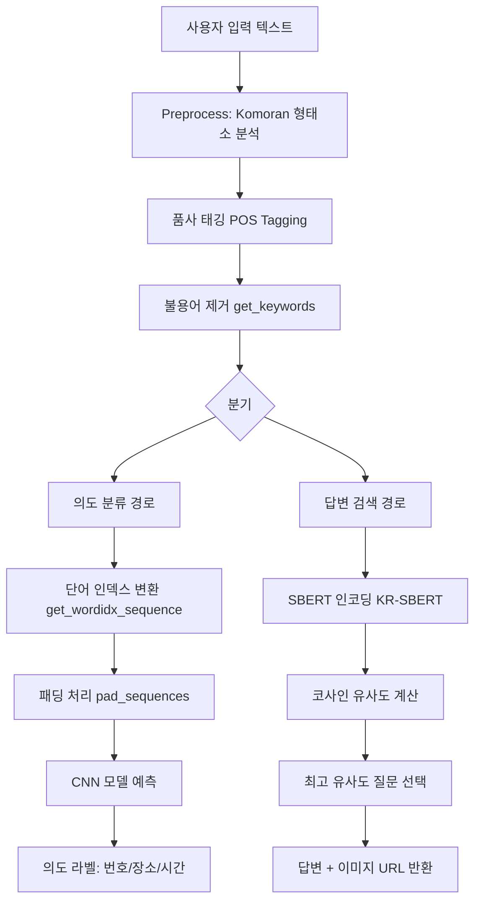

# Architecture

## NLP 파이프라인 상세

### 전체 처리 흐름



## Preprocess 모듈

### 클래스: `Preprocess` (`util/preprocess.py`)

형태소 분석과 텍스트 전처리를 담당하는 핵심 모듈입니다.

```
Preprocess
├── __init__(word2index_dic, userdic)
│   ├── chatbot_dict.bin 로드 (단어→인덱스 사전)
│   └── Komoran 초기화 (사용자 사전 포함)
│
├── pos(sentence) → [(형태소, 품사), ...]
│   └── Komoran.pos() 래퍼
│
├── get_keywords(pos, without_tag) → [키워드, ...]
│   └── 불용어 품사 제거 (조사, 기호, 어미, 접미사)
│
└── get_wordidx_sequence(keywords) → [인덱스, ...]
    └── 단어 → 인덱스 변환 (OOV 처리 포함)
```

### 제거 대상 품사 (불용어)

| 품사 코드 | 설명 | 예시 |
|-----------|------|------|
| JKS, JKC, JKG, JKO, JKB, JKV, JKQ | 격조사 | 이/가, 을/를, 의, 에서 |
| JX, JC | 보조사, 접속조사 | 은/는, 도, 와/과 |
| SF, SP, SS, SE, SO | 기호 | . , ! ? " ' |
| EP, EF, EC, ETN, ETM | 어미 | -다, -고, -는 |
| XSN, XSV, XSA | 접미사 | -적, -화, -스럽 |

## Intent Model (의도 분류)

### CNN 아키텍처 (`model/intent/train_intent.py`)

```
Input Layer (MAX_SEQ_LEN)
        │
Embedding Layer (VOCAB_SIZE → 128)
        │
    Dropout (0.5)
        │
   ┌────┼────┐
   │    │    │
Conv1D Conv1D Conv1D
(k=3) (k=4) (k=5)
 128   128   128
   │    │    │
GMP  GMP  GMP
   │    │    │
   └────┼────┘
        │
   Concatenate (384)
        │
   Dense (128, ReLU)
        │
   Dropout (0.5)
        │
   Dense (3, Softmax)
        │
   Output: [번호, 장소, 시간]
```

GMP = GlobalMaxPool1D

### 의도 분류 레이블

| 레이블 | 의도 | 키워드 예시 |
|--------|------|------------|
| 0 | 번호 | "번호", "전화" |
| 1 | 장소 | "어디", "장소", "위치", "주소" |
| 2 | 시간 | "시작", "마감", "언제", "기간", "시간" |

### IntentModel 클래스 (`model/intent/intent_model.py`)

```python
class IntentModel:
    def __init__(self, model_name, preprocess):
        self.labels = {0: "번호", 1: "장소", 2: "시간"}
        self.model = load_model(model_name)  # .h5 파일
        self.p = preprocess

    def predict_class(self, query):
        pos = self.p.pos(query)           # 형태소 분석
        keywords = self.p.get_keywords()   # 불용어 제거
        sequences = [self.p.get_wordidx_sequence(keywords)]
        padded = pad_sequences(sequences, maxlen=MAX_SEQ_LEN)
        predict = self.model.predict(padded)
        return tf.math.argmax(predict, axis=1).numpy()[0]
```

## FindAnswer 모듈 (답변 검색)

### 클래스: `FindAnswer` (`util/find_answer.py`)

```
FindAnswer
├── __init__(preprocess, df, embedding_data)
│   ├── KR-SBERT 모델 로드 (snunlp/KR-SBERT-V40K-klueNLI-augSTS)
│   ├── 질문 데이터프레임 저장
│   └── 사전 계산된 임베딩 데이터 저장
│
└── search(query, intent) → (질문, 점수, 답변, 이미지URL, 의도)
    ├── 1. 형태소 분석 + 불용어 제거
    ├── 2. 전처리된 질문을 SBERT로 인코딩
    ├── 3. 코사인 유사도 계산 (query vs 전체 임베딩)
    ├── 4. 최고 유사도 인덱스 선택
    ├── 5. 의도 일치 여부 확인
    └── 6. 답변, 점수, 이미지 URL 반환
```

### 유사도 검색 흐름

```
사용자 질문: "서울역 전화번호 알려줘"
        │
        ▼
Komoran 형태소 분석
→ [("서울역", "NNP"), ("전화번호", "NNG"), ("알려", "VV"), ("주", "VX")]
        │
        ▼
불용어 제거
→ ["서울역", "전화번호", "알려", "주"]
        │
        ▼
SBERT 인코딩
→ [0.23, -0.15, 0.87, ...] (768차원 벡터)
        │
        ▼
코사인 유사도 계산 (vs 전체 질문 임베딩)
→ [0.12, 0.89, 0.34, 0.91, ...]
        │
        ▼
최고 유사도 질문 선택 (인덱스: 3, 유사도: 0.91)
→ 질문: "서울역 연락처"
→ 답변: "서울역 대표전화 1544-7788"
```

## 학습 데이터 파이프라인

```
원본데이터/
├── 용도별 목적대화 데이터/ (AI Hub JSON)
├── 주제별 일상 대화 데이터/ (AI Hub JSON)
├── ko_wiki_v1_squad.json    (일반상식 QA)
└── ratings.txt              (네이버 영화 리뷰)
        │
        ▼ data_to_csv.py
변형데이터/
├── 용도별목적대화데이터.csv
├── 주제별일상대화데이터.csv
├── 일반상식.csv
├── 영화리뷰.csv
└── 통합본데이터.csv
        │
        ▼ create_train_data.py
model/intent/
└── train_data.csv (text, label 컬럼)
        │
        ▼ train_intent.py
model/intent/
└── intent_model.h5 (학습된 CNN 모델)
```

## 소켓 통신 아키텍처

`BotServer` 클래스가 TCP 소켓 서버를 제공합니다.

```
BotServer (port, listen_num)
├── create_sock() → 소켓 생성 & 바인드
├── ready_for_client() → 클라이언트 접속 대기
└── get_sock() → 소켓 객체 반환

서버 ◀──── TCP 연결 ────▶ 클라이언트
(질문 수신 → NLP 처리 → 답변 전송)
```
